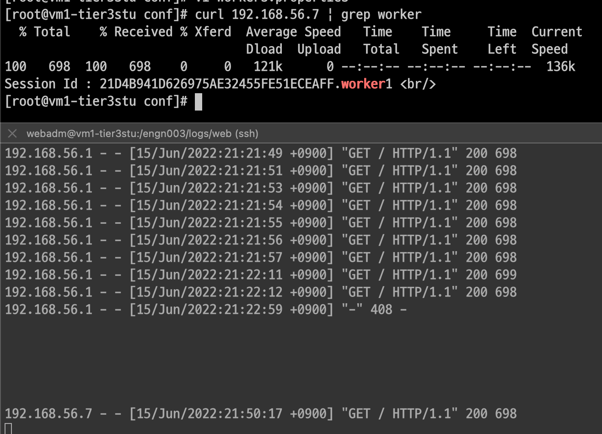
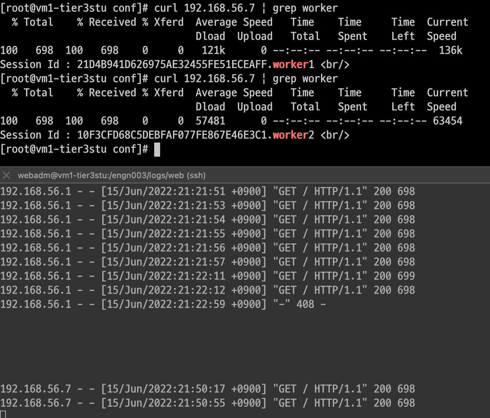
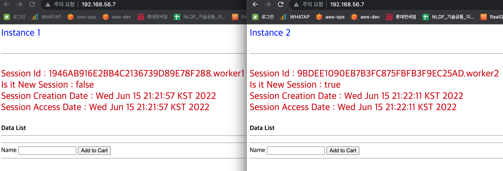

## 🖍  웹서버1대(vm1) 톰캣2대(vm1,vm2) 연동( mod_jk)

> 환경 : VirtualBox6.1 , Apache2.4.53, Tomcat8.5.79, mod_jk1.2.48
>
>
> 네트워크 옵션 : 네트워크1(NAT) 네트워크2(HostOnly)
>
> Gateway : 192.168.56.1
>
> > nat ip : 10.0.2.15
> >
> >
> > vm1  ip: 192.168.56.7
> >
> >
> > vm2  ip: 192.168.56.8
> >
> >
> Directory : /engn002/web/apache
>

---

apache와 tomcat은 설치되어 있으셔야 합니다.

저는 apache를 소스(컴파일)로 직접 설치했습니다.

---

## 📁 MOD_JK Install

> 다운로드 [https://tomcat.apache.org/download-connectors.cgi](https://tomcat.apache.org/download-connectors.cgi)
또는 [https://archive.apache.org/dist/tomcat/tomcat-connectors/jk/](https://archive.apache.org/dist/tomcat/tomcat-connectors/jk/)
>

$ wget [https://archive.apache.org/dist/tomcat/tomcat-connectors/jk/tomcat-connectors-1.2.48-src.tar.gz](https://archive.apache.org/dist/tomcat/tomcat-connectors/jk/tomcat-connectors-1.2.46-src.tar.gz)

$ tar xvf tomcat-connectors-1.2.48-src

$ cd tomcat-connectors-1.2.48-src/native/

## 📘 apache설치한 경로의 apxs 경로에 커넥터를 설치해야한다.

$ ./configure --with-apxs=/engn002/web/apache/bin/apxs

$ make && make install

- 확인
    - $ ls -al /engn002/web/apache/conf/modules | grep mod_jk.so
- mod_jk.so가 있으면 설치가 된거임

---

## 📙 apache httpd.conf 수정

$ vi /engn002/apache/conf/httpd.conf

따로 mod_jk.conf파일을 생성하지않음(가끔 연동오류가 발생함)-그냥 httpd.conf안에 선언함

소스 맨 아래쪽에 작성

```
LoadModule jk_module modules/mod_jk.so

<IfModule jk_module>
        JkWorkersFile conf/workers.properties
        JkShmFile /engn003/logs/web/mod_jk.shm
        JkLogFile /engn003/logs/web/mod_jk.log
        JkLogLevel info
        JkLogStampFormat "[%y %m %d %H:%M:%S] "
        JkMount /* lb
</IfModule>

<VirtualHost *:80>
ServerName localhost
JkMount /* lb
</VirtualHost>
```

$ vi /engn002/apache/conf/workers.properties

```
worker.list=worker1,worker2,lb

worker.worker1.port=8009
worker.worker1.host=192.168.56.7
worker.worker1.type=ajp13
worker.worker1.lbfactor=1

worker.worker2.port=8010
worker.worker2.host=192.168.56.8
worker.worker2.type=ajp13
worker.worker2.lbfactor=1

worker.lb.type=lb
worker.lb.balance_workers=worker1,worker2
worker.lb.sticky_session=false
```

## 📕 중요!!

> sticky_session의 기본값이 true이기 때문에 값을 선언하지 않으면 sticky_session이 true 적용이 된다.
>
>
> > sticky_session이 적용이 되면 웹서버ip(192.168.56.7)로 계속 접속을 해도 vm1(192.168.56.7)의 설치된 톰캣만 계속 보여준다.(서버에서는 curl 192.168.56.7로 계속 접속하면 tomcat1과 tomcat2가 번가아가면서 나오면 제대로 나오는게 맞는거다..) 하지만 크롬에서 확인할 경우 톰캣1만 나온다.
> >
> >
> > 그래서 worker파일에서 sticky_session을 false로 선언해야한다.
> >

---

## 🖊 Tomcat 설정

$ vi conf/server.xml

주석 처리 되어있으면 지워주고 아래와 같이 작성

tomcat1,2 둘 다 변경하고 port만 다르게 설정

```xml
<Connector protocol="AJP/1.3"
	address="0.0.0.0"
        secretRequired="false"
        port="8009"
        redirectPort="8443" />
```

서버 2대에 톰캣을 한개 씩 설치하기 때문에 기본 포트(8080), 서버 포트(8005), ajp 포트(8009)는 같아도 상관없음

만약 tomcat1,2를 하나의 서버에 톰캣2개를 설치하면 포트는 서로 달라야함

## 🖌  서버에서 테스트

$ curl 192.168.56.7

# 첫번째 확인



# 두번째 확인



# 로컬에서 테스트



로컬에서 웹서버ip로 확인(새로고침해서 tomcat1,2가 따로 나오면 성공)


<details>
<summary>[ERROR]</summary>


[ERROR] Unable to start due to shared memory failure

해당 오류는 설정파일에 디렉토리 선언이 잘 못 되어있는 경우에 발생함(디렉토리 경로가 존재하는지 확인)

[ERROR] permission 에러가 발생하면 tomcat 디렉토리에 권한 부여하기

$ chmod 755 -R tomcat8-1/
</details>

```toc

```
