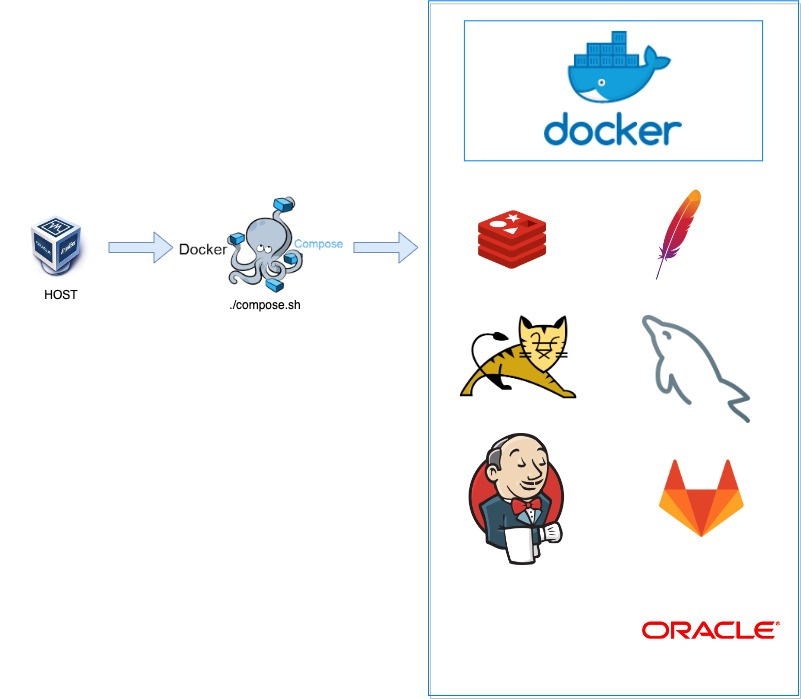

<span style="color:red">해당 글은 상세한 사용법을 제공하진 않습니다.</span>

apache, tomcat, jenkins, gitlab, docker, docker-compose에 대한 기본 이해가 필요하며,

이 글에서 제공하는 컨테이너로 공부하실 때 참고하시면 좋을 것 같습니다.

[프로젝트 다운로드](https://github.com/im-happy-coder/docker-devland)

---

## 🍰 Start

Docker를 활용하여 개발에 필요한 시스템을 컨테이너화하고 쉽게 개발환경을 공유할 수 있고 동일한 환경에서 사용할 수 있다.

해당 Docker-devland 프로젝트는 단순하게 웹서버, WAS, CI, CD 하는 것이 아닌

웹서버와 WAS 연동 및 세션 클러스터링 환경과 JNDI 이용하여 서버에 있는 DB정보를 읽어서 어플리케이션과 Connection하는 기능을 추가하였다.

모니터링 시스템은 JMX 모니터링을 이용하여 WAS의 상세 모니터링이 가능하다.

Redis를 이용한 Object Cache, chainedtransaction를 이용하여 Mysql, Oracle의 트랜잭션을 구현하였다.

Docker 환경에서 사용될 샘플 소스 코드는 아래 링크에서 받으면 된다.

[https://github.com/im-happy-coder/docker-devland-application](https://github.com/im-happy-coder/docker-devland-application)

### 🦉 Service list

- apache + tomcat modJK Connector
- JNDI(Java Naming Directory Interface)
- JMX(Java Management Extensions)
- Session Clustering
- Object Cache
- Chanedtransaction Manager

### 🎩 Specification

> CentOS 7
>
> Docker version 20.10.16
>
> docker-compose version 1.24.0
>
> JDK 1.8.0_201
>
> MAVEN 3.6.1
>

### 🎓 Directory Structure

```shell
.
├── compose.sh
├── docker
│   ├── docker-compose-gitlab.yml
│   ├── docker-compose-httpd.yml
│   ├── docker-compose-jenkins.yml
│   ├── docker-compose-mysql.yml
│   ├── docker-compose-oracle11g.yml
│   ├── docker-compose-redis.yml
│   └── docker-compose-tomcat.yml
├── httpd
│   ├── build
│   ├── conf
│   └── conf.d
├── img
│   ├── composeDown.PNG
│   └── composeUp.PNG
├── jenkins
│   └── build
├── mode.sh
├── README.md
└── tomcat
    ├── build1
    ├── build2
    ├── conf1
    ├── conf2
    ├── target1
    └── target2

```

### 👓 JDK, MAVEN SetUp

JDK, MAVEN PATH
```
/app/jdk1.8.0_201
/app/apache-maven-3.6.1
```

$ vi ~/.bash_profile

```shell
JAVA_HOME=/app/jdk1.8.0_201
M2_HOME=/app/apache-maven-3.6.1
PATH=$JAVA_HOME/bin:$M2_HOME/bin:$PATH:$HOME/bin

export JAVA_HOME M2_HOME PATH

```

---

## 🌂 Start Docker Project

$ git clone https://github.com/im-happy-coder/docker-devland.git

### 🧤 Sample Source code

$ git clone https://github.com/im-happy-coder/docker-devland-application.git

### 🧳 Server setting

$ vi /etc/my.cnf

my.cnf 파일 내용 수정

```
[mysqld]
skip-host-cache
skip-name-resolve
datadir=/var/lib/mysql
socket=/var/lib/mysql/mysql.sock
secure-file-priv=/var/lib/mysql-files
user=mysql

pid-file=/var/run/mysqld/mysqld.pid
```

### 🥄 docker-compose all up and all down

$ ./compose.sh up

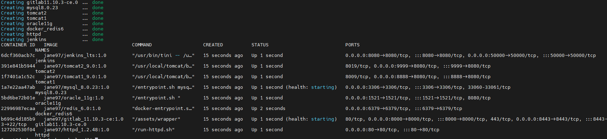

$ ./compose.sh down

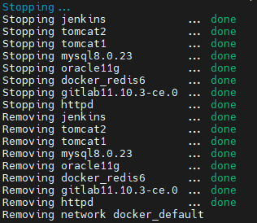

### 🧊 MYSQL DB Settings

$ docker container exec -it mysql8.0.23 /bin/bash

$ mysql -u root -p

- 패스워드 : 없음(엔터키)

$ use mysql

- 계정 확인
    - $ select host, user, authentication_string from user;
- 외부 접속 계정 만들기 # mysql8버전부터는 grant user 불가능
    - $ CREATE USER 'wasdb'@'%' IDENTIFIED BY 'root';
    - $ GRANT ALL PRIVILEGES ON  *.* TO 'wasdb'@'%' WITH GRANT OPTION;
    - $ FLUSH PRIVILEGES;
- 다시 확인
    - $ select host, user from mysql.user;
- 생성한 계정으로 로그인
    - mysql - wasdb - root
- DB 생성
    - create database javatest
- DB 접속
    - use javatest

- 아래 Query 수행

```
create table board(
bid INT PRIMARY KEY AUTO_INCREMENT,
title VARCHAR(100),
content VARCHAR(1000),
 writer VARCHAR(50) NOT NULL,
passwd VARCHAR(50) NOT NULL,
writeDate VARCHAR(50) NOT NULL);

Chainedtansaction 테스트하기 위해 잃부러 DB 데이터의 null 데이터를 삽입한다.

insert into board(title, content, writer, passwd, writeDate) values('test1', '', 'kim', '1234', NOW());
```

### 🍸 ORACLE DB Settings

$ docker container exec -it oracle11g /bin/bash

$ sqlplus

- 계정 생성 필요없이 기본 계정 사용
    - ID: system
    - PASSWD : oracle

- 아래 Query 수행
```
CREATE TABLE board_tb(
 useid NUMBER(10),
 uname VARCHAR(100),
 age VARCHAR(1000),
 address VARCHAR(50) NOT NULL,
 country VARCHAR(50) NOT NULL,
 writeDate VARCHAR(50),
 PRIMARY KEY(useid));


Chainedtansaction 테스트하기 위해 잃부러 DB 데이터의 null 데이터를 삽입한다.

insert into board_tb values(seq_board.nextval,'','oraclecontent1','asung','oracle1',sysdate);
```

이제 준비는 끝났다. 

배포 환경을 만들어 주자

## 🍶 Gitlab 프로젝트 생성

GitLab에 로그인하고 새 프로젝트를 만들어서 Sample Source를 올려줍니다.

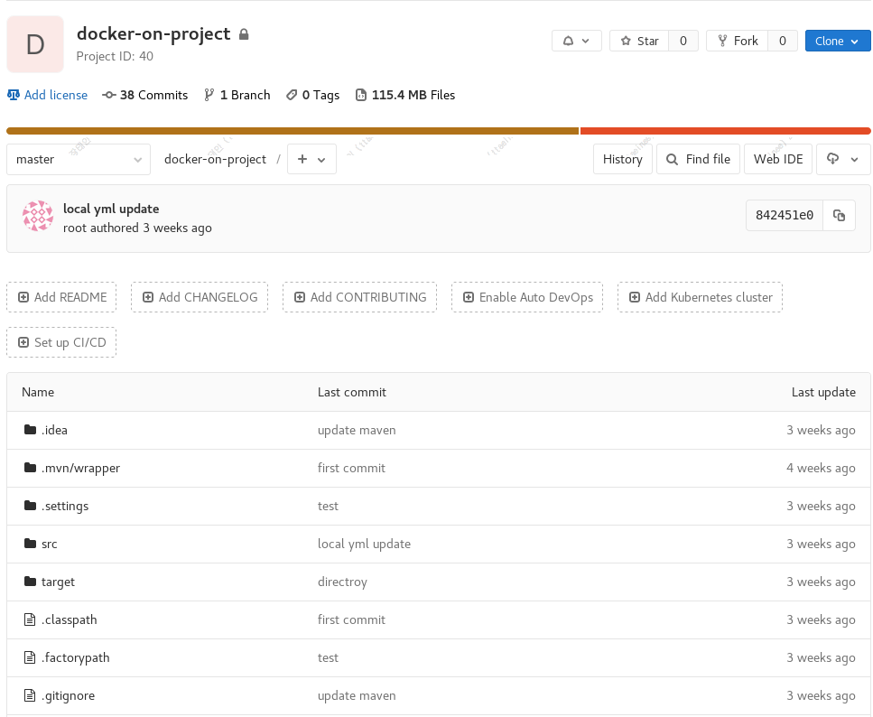

## 🍵 Jenkins SSH 배포

JENKINS 프로젝트 생성

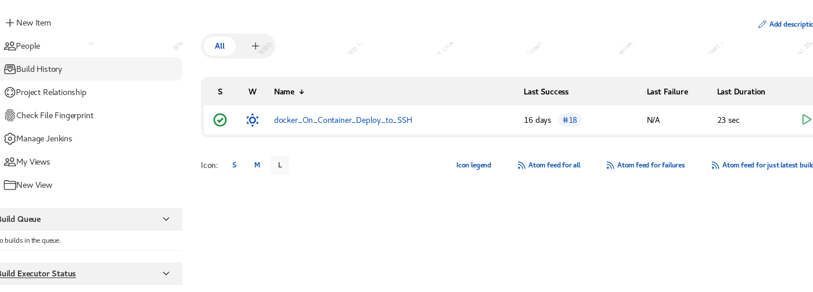

Gitlab 프로젝트와 연결 후 Jenkins SSH 원격 배포

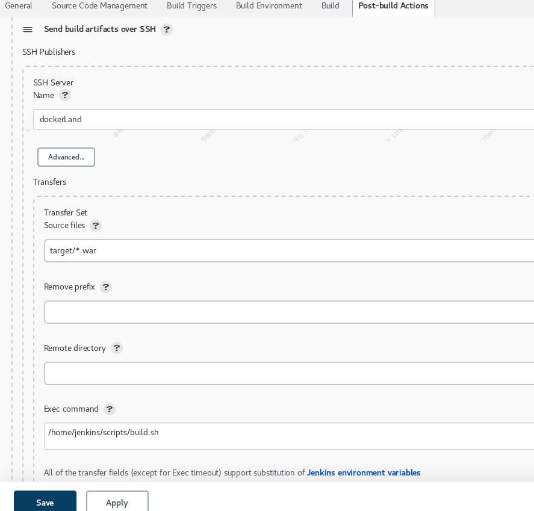

배포 스크립트

build.sh

```shell
#! /bin/sh

# build script to deploy

# backup war
cd ~/docker-devland/tomcat/target1
mv ROOT.war backup_war/ROOT_back$(date '+%Y-%m-%d-%T')
rm -rf ROOT

cd ~/docker-devland/tomcat/target2
mv ROOT.war backup_war/ROOT_back$(date '+%Y-%m-%d-%T')
rm -rf ROOT

#move war
find /home/jenkins/target/* -type f -name '*.war' -exec mv {} ~/docker-devland/tomcat/target1/ROOT.war \;

cp ~/docker-devland/tomcat/target1/ROOT.war  ~/docker-devland/tomcat/target2/ROOT.war

# restart Docker Tomcat
/home/jenkins/scripts/restart.sh
```

restart.sh

```shell
#! /bin/sh

# docker tomcat restart

docker container stop tomcat1

docker container stop tomcat2

sleep 3;

docker container start tomcat1

docker container start tomcat2

```

## 🧉 REDIS 설정 정보 변경

Sample Source 코드의 /resource/application-local.yml 파일 수정

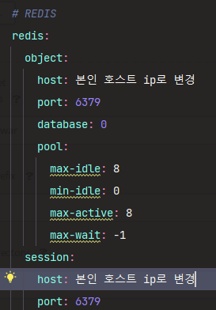


## 🥜 배포 진행 후 서비스 확인하기

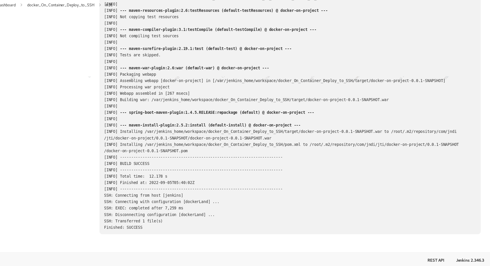

ROOT.war가 target 디렉토리에 생성되었는지 확인

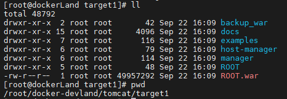

http://서버IP 입력하여 브라우저에서 정상적으로 작동하는 지 확인

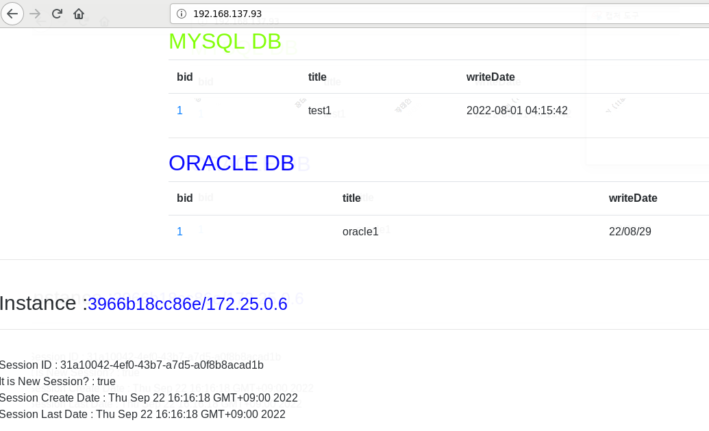

새로 고침하면 httpd에 연결된 톰캣1, 톰캣2가 번갈아 가면서 나옴

### 🥛 Redis Cache확인 및 Chainedtransaction 확인하기

- Redis Session Cache 확인

$ docker container exec -it redis6 /bin/bash

$ redis-cli

$ keys *

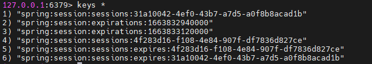


- Redis Object Cache 확인

서버에서 확인해도 됨

이번엔 Redis Desktop Manager로 확인

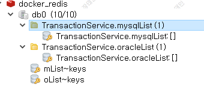

- Chainedtransaction 확인하기

서버에서 로그 보기

$ docker container logs -f -n 100 tomcat1 | grep -A 10 NULL

브라우저에서 http://서버IP:8888 접속 

브라우저 화면에서 수정 버튼 클릭하여 oracle, mysql 둘 중 한 곳에만 값을 입력해 줍니다.

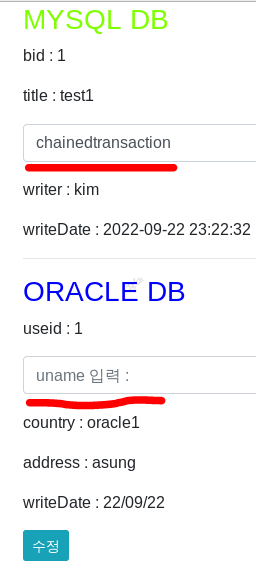

화면에 ERROR 페이지가 뜨면 서버에서 로그를 확인하면 아래와 같이 로그가 찍힙니다.


## 🍫 JMX 모니터링 확인하기

docker tomcat1, tomcat2 IP 확인

$ docker container inspect tomcat1 | grep -A 10 IPA

$  docker container inspect tomcat2 | grep -A 10 IPA

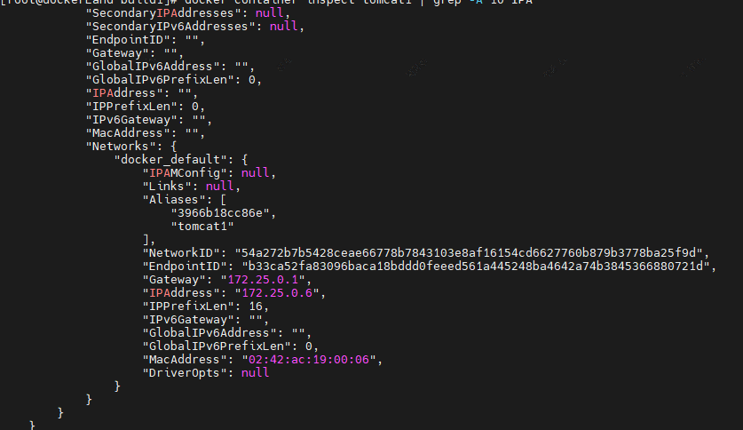

서버에서 본인이 설치한 JDK의 bin 디렉토리로 이동합니다.

jconsole 실행

$ ./jconsole

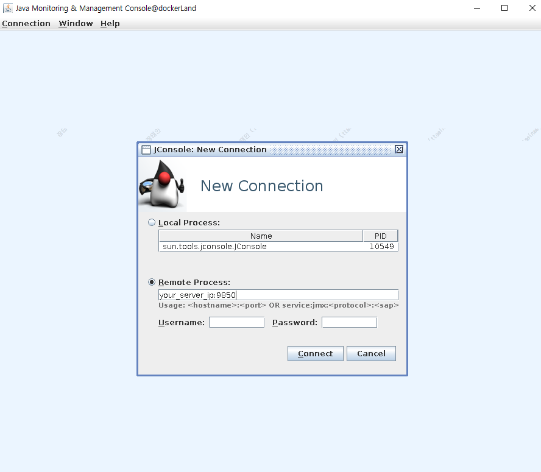

위에서 확인한 IP:포트 입력

tomcat1 JMX PORT : 9850

tomcat2 JMX PORT : 9860

모니터링

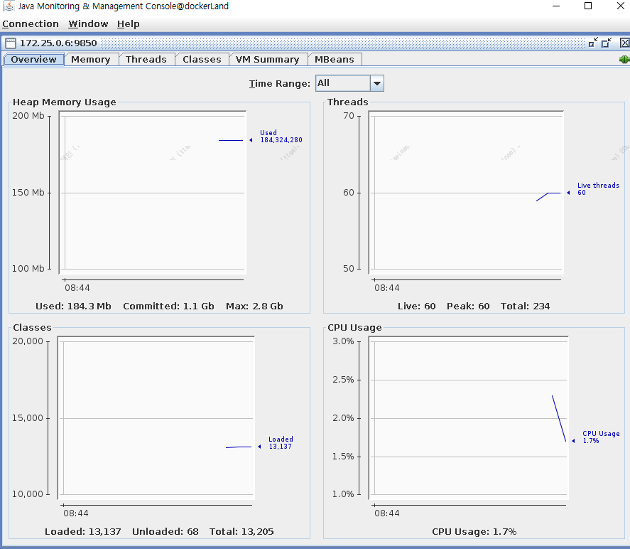

## 🧂 개인 Registry 서버 사용

이미지를 효율적으로 관리하기 위해 개인 Registry 서버를 만듬

개인 Registry 서버에 있는 이미지 목록

- 브라우저에서 이미지 확인

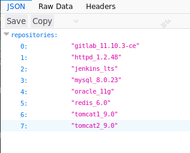

- 서버에서 이미지 확인

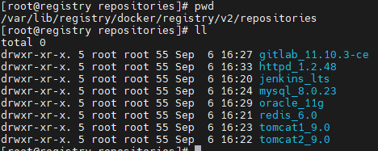

```toc

```
