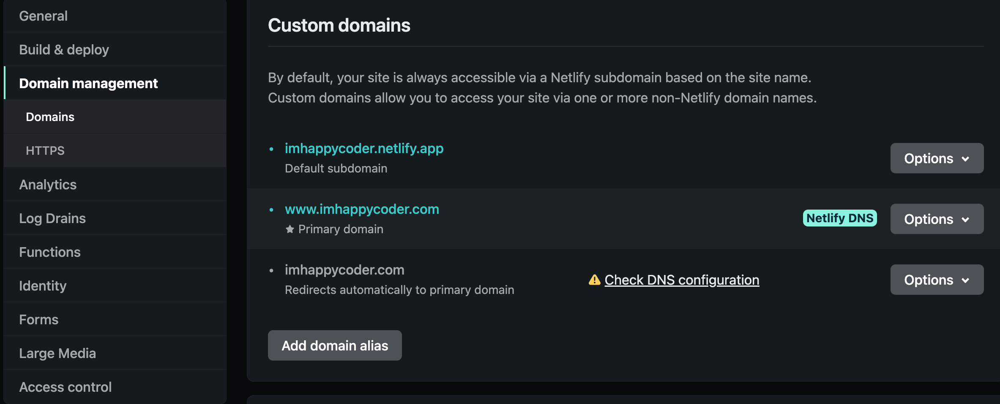

## 💦 환경

> macOs (BigSur v11.6.1)
> 
> 
> Homebrew v3.6.1
> 
> node v16.17.0
> 
> npm v8.15.0
> 
> yarn v1.22.19
> 
> Gatsby CLI v4.22.1
> 
> Gatsby v4.9.3
> 

---
<details>
<summary>🐚  Front 개념 (참고용) </summary>

- SEO(검색엔진최적화)
  - 검색엔진이 웹을 크롤링 하면서 페이지에 컨텐츠 색인을 생성하는 과정
    
---

- CSR, SSR의 차이
    - CSR(Client Side Rendering)
        - SPA방식
    - SSR(Server Side Rendering)
        - MPA 방식
    - 웹페이지 로딩 시간
        - 첫 페이지 로딩시간
            - CSR의 경우 HTML,CSS와 모든 스크립트들을 한 번에 불러온다.
            - SSR은 필요한 부분의 HTML과 스크립트만 불러온다.
            - 따라서 SSR이 더 빠르다.
        - 나머지 로딩 시간
            - 첫 페이지를 로딩한 후, 사이트의 다른 곳으로 이동하는 식의 동작을 가정하면CSR은 이미 첫 페이지 로딩할 때 나머지 부분을 구성하는 코드를 받아왔기 때문에 빠르다
            - 반면 SSR은 첫 페이지를 로딩한 과정을 정확하게 다시 실행한다. 그래서 더 느리다.
    - SEO대응
        - 검색엔진은 자동화된 로봇인 '크롤러'로 웹사이트들을 읽는다.CSR은 자바스크립트를 실행시켜 동적으로 컨텐츠가 생성되기 때문에 자바스크립트가 실행 되어야 meatadata가 바뀐다.(이전 크롤러들은 자바스크립트를 실행시키지 않았었기 때문에 SEO최적화가 필수적이었다, 구글이 그 트렌드를 바꾸고 있다고 한다)SSR은 애초에 서버 사이드에서 컴파일되어 클라이언트로 넘어오기 때문에 크롤러에 대응하기 용이하다.
    - 서버 자원 사용
        - SSR이 서버 자원을 더 많이 사용한다. 매번 서버에 요청을 하기 때문이다.
        - CSR은 클라이언트에 일감을 몰아주기 때문에 서버에 부하가 적다.
- SSR을 사용해야할 경우
    - 네트워크가 느릴 때
    - SEO가 필요할때
    - 최초 로딩이 빨라야할 때
    - 메인 스크립트가 크고 로딩이 매우 느릴 때 (CSR은 메인스크립트가 로딩이 끝나면 API로 데이터 요청을 보낸다)
    - 웹 사이트가 상호작용이 별로 없을 때
- CSR을 사용해야할 경우
    - 네트워크가 빠를 때
    - 서버의 성능이 좋지 않을 때
    - 사용자에게 보여줘야 하는 데이터의 양이 많을 때 (로딩창을 띄울 수 있다)
    - 메인 스크립트가 가벼울 때
    - SEO가 필요 없을 때
    - 웹 어플리케이션이 상호작용이 많을 때 (아예 렌더링이 되지 않아서 사용자의 행동을 막는 것이 유리할 수 있다.)

---

- SPA와 MPA
    - SPA(Single Page Application)
        - 하나의 페이지로 구성된 웹 어플리케이션
        - 브라우저에 최초에 한번 페이지 전체를 로드하고, 이후부터는 특정 부분만 ajax를 통해 데이터를 바인딩하는 방식이다.
        - react, vue, 앵귤러 등 자바스크립트 프레임워크 등이 SPA를 지원한다.
        - CSR방식
    - MPA(Multi PAge Application)
        - 여러 페이지로 구성된 웹 어플리케이션
        - 사용자의 클릭과 같은 인터렉션이 발생할 때마다 서버로부터 새로운 html을 받아와서 해당 링크로 이동하여 페이지 전체를 새로 렌더링하는 전통적인 웹 페이지 구성 방식이다.
        - SSR방식

---

- Node.js란
    - 노드는 Chrome V8 JavaScript 엔진으로 빌드 된 JavaScript 런타임이다.
      즉, 노드는 자바스크립트 애플리케이션을 실행할 수 있으며, 서버를 실행하는 데 제일 많이 사용된다.
    - 자바스크립트를 서버에서도 사용할 수 있도록 만든 프로그램이다.
    - V8이라는 자바스크립트 엔진 위에서 동작하는 자바스크립트 런타임(환경)이다.
    - 노드는 서버 사이트 스크립트 언어가 아니다. 프로그램(환경)이다.
    - 노드는 웹서버와 같이 확장성 있는 네트워크 프로그램을 제작하기 위해 만들어졌다.
- npm이란
    - npm은 Node Packaged Manager의 약자이다.
      즉, centos의 yum, macOs의 homebrew처럼 패키지를 관리하는 매니저다.
- yarn이란
    - yarn은 javascript 패키지 매니저다.
      패키지 의존성을 관리하는 툴이다.(third-party 모듈이라고 불린다)
    - 그럼 yarn과 npm은 무슨 차이인가?
        - yarn은 npm과 마찬가지로 패키지의 저장소를 제공한다.
          시스템에서 의존 패키지를 설치하고 업데이트 할 수 있도록 도와준다.
          package.json파일을 통해 해당 프로젝트가 의존하고 있는 모든 패키지를 구분하고
          package.json에 있는 dependency필드를 기반으로 패키지를 설치한다.
        - 즉, node_modules 폴더 대신, package.json파일만 가지고 공유하므로 데이터의 낭비를 줄일 수 있다.
- Gatsby란
    - 먼저 JAM Stack를 알아야한다.

      

- JAM Stack이란  (JavaScript API Markup Stack)
    - 최근 프론트엔드 시장에서 빠르게 발전하고 있는 정적 페이지 개발을 위한 스택이다.
      더 빠르고, 안전하고, 스케일하기 쉬운 웹을 만들기 위해 디자인된 아키텍처라고 생각하면 된다.
    - 전통적인 웹사이트 방식은 서버에서 DB를 거쳐 CMS(Content Management System)로 부터 추출한 데이터를 프론트 단에서 보여준다.
    - JAM Stack를 이용하면 마크업 요소들과 다양한 API를 통해 만든 정적 웹 사이트를 Pre-Render한 것을 CND(Content Delivery Network)을 통해 웹 사이트를 열람할 수 있다.
- 그럼 왜 Gatsby를 사용하는지
    - JAM Stack기반 프레임워크는 Next, Gatsby, Nuxt, Jekyll이 있다.
      Next.js가 제일 인기가 많고 그 다음이 Gatsby이다.
      그 이유는 두 프레임워크의 사용 용도가 다르기 때문이다.
      Next.js는 정적 사이트 생성의 기능도 가지고 있지만 주로, 서버 사이드 렌더링을 위해 사용하는 프레임워크이다. 서버와 통신을 하면서 요청이 있을 시 마다 동적으로 웹 사이트를 생성한다.
    - Gatsby는 서버 없이 오로지 정적 사이트를 생성하기 위해 사용하는 프레임워크이다.
      그래서 주로 소개 페이지나 블로그 등에 많이 사용된다.

GitBlog 테마로 Jekyll 테마도 많이 사용되는데 Gatsby 테마를 사용하는 이유는

Jekyll은 Ruby로 작성되서 커스텀하기 어렵고 그렇다고 Ruby를 공부하고 싶진 않다 ㅠㅠ

Gatsby는 React기반 프레임워크이기 때문에 React만 알고 있으면 커스텀할 수 있어서 좋다.

근데 나는 React도 모른다

단지 React 공부할 예정이어서 Gatsby 테마로 선택했다..
</details>

---

## 🏹  GitHub 설정

- GitHub Repository 하나 생성해줍니다.
- Repository 이름은 본인 ID + github.io 입력하면 됩니다.
- 저는 이미 만들었기 때문에 생성하지 못한다고 나오네요~


---

## 🎲 도메인 설정

- 도메인 구매
    - 저는 [https://www.hosting.kr/](https://www.hosting.kr/) 에서 구매하였습니다.

    다른 곳도 많으니 원하시는 곳에서 구매하시길 추천드립니다.

    제가 구매한 도메인은 www.imhappycoder.com 입니다.
- 호스팅 사이트에서 도메인 레코드 설정
    - 도메인 관리 —> DNS 레코드 관리 이동 후 —> 새 DNS 레코드 추가
- GitHub가 사용하는 레코드와 본인이 구매한 도메인 레코드를 추가하면 됩니다.
- 유형은 A, 이름은 @ 입니다. 값은 아래 있는 거 하나씩 입력
```
185.199.108.153
185.199.109.153
185.199.110.153
185.199.111.153
```
- 본인이 구매한 도메인 이름이 “testdns”이면 CNAME 값 필드에 “testdns.github.io”로 입력하시면 됩니다.
- 유형은 CNAME, 이름은 www, 값은 도메인이름.github.io 입니다.
TTL은 보통 1시간을 해놓습니다.


아까만든 Github Repository 설정을 변경해줍니다.

Page에서 Custom domain에 구입한 도메인을 입력하고 DNS Check를 해줍니다.<br/>확인하는데 시간이 조금 걸립니다.

아래에 Enforce HTTPS 체크박스에 체크해주시면 됩니다.<br/>DNS 확인 중이여도 이 체크박스만 체크가 되면 사용하는데에 문제없습니다.


Custom domain을 설정하고 나면 CNAME 파일이 레포지토리에 자동 생성됩니다.

---

## 🌼 Gatsby 테마 사용하기

- Gatsby 설치

```
npm install -g gatsby-cli
```

- Gatsby 프로젝트 만들기

제가 받은 테마는 zoomkoding-gatsby-blog 테마입니다.

```
gatsby new [프로젝트 이름] [적용할 테마의 주소]
gatsby new my-gatsby-blog https://github.com/zoomKoding/zoomkoding-gatsby-blog
```

테마는 여러분들이 사용하실 테마를 고르신 후 해당 테마의 GitHub URL을 적으시면 됩니다.

Gatsby 테마 모음 사이트 [https://www.gatsbyjs.com/starters/](https://www.gatsbyjs.com/starters/)

- 생성한 Gatsby 프로젝트를 GitHub Repository에 Push해줍니다.
```
git init
git branch -M main
git add .
git commit -m "message"
git remote add origin "본인이생성한Repositry주소.git"
git push -u origin main
```

GitHub에서 repository 확인하여 정상적으로 gatsby 프로젝트가 배포되었는지 확인하기.

<details>
<summary style="color: red">push하고 [ERORR] 발생 시</summary>


```
 ! [rejected]        main -> main (fetch first)
error: failed to push some refs to 'https://github.com/im-happy-coder/im-happy-coder.github.io.git'
hint: Updates were rejected because the remote contains work that you do
hint: not have locally. This is usually caused by another repository pushing
hint: to the same ref. You may want to first integrate the remote changes
hint: (e.g., 'git pull ...') before pushing again.
hint: See the 'Note about fast-forwards' in 'git push --help' for details.
```

- 아래 명령어로 푸쉬
```
git push -u --force origin main
```
</details>

---

## 🛕 Netlify 배포 하기

배포 방식은 Netlify와 Github Pages 두 가지 있습니다.

저는 Custom domain을 사용하기 때문에 Netlify가 적절하다고 판단하여 Netlify로 배포하겠습니다.

만약 Cusom domain을 사용하지 않으시면 Github Pages로 배포해주세요.

[여기](https://hislogs.com/make-gatsby-blog/) 클릭 하셔서 7.Github Pages로 배포하기 보셔서 하시면 됩니다.

1. Netlify 회원가입 [https://netlify.com](https://netlify.com)
2. GitHub 계정과 Repository 연동 해주세요(저는 회원가입하고 로그인하니까 연동 할 수 있게 바로 페이지가 뜨더라구요)
3. Netlify CLI 설치
    ```
    npm install -g netlify-cli
    ```
4. Gatsby 프로젝트 디렉토리에 netlify.toml 생성
    ```
    [build]
      publish = "public"
      command = "npm run build"
    [build.environment]
      NODE_VERSION = "14"
      NPM_VERSION = "7.6.0"
    ```
5. Netlify에 Gatsby 프로젝트 업로드
    ```
    yarn build
    netlify deploy --prod
    ```
    해당 명령어 입력하면 Site name 입력하라고 하는데 엔터치고 넘어가도 상관없습니다.
    name은 Netlify 사이트에서 변경할 수 있어요.

6. 호스팅 사이트에서 CNAME 변경 (CNAME 레코드 값을 "도메인이름.netlify.app" 으로 변경)
    

7. Netlify 사이트 설정
    - 사이트 이름 변경하는 법
    - Netlify접속 > 본인이 등록한 Repository 클릭 > 상단 맨 왼쪽에 Site Settings 클릭 > 아래 Site infomation에 Change site name 클릭
   

8. Netlify Custom domain 등록
   - Netlify 사이트에 등록된 레포지토리 클릭
   - Domain settings에 custom domains에 도메인을 입력해 줍니다.
   - 도메인이 등록 완료되면 아래와 같이 도메인이 확인됩니다.
   
   - 아래에 HTTPS 인증도 같이 해주세요
   

9. Repository에 push시 자동 배포 설정
    - Build & Deploy 탭에서 Build settings
    - Build Command 값 수정 -> CI=false npm run build
   
    - 이제 repository에 push하면 자동으로 Netlify가 배포를 시작합니다.
    
로컬에서 먼저 테스트

Gatsby 프로젝트 디렉토리로 이동
```
yarn gatsby develop
```
정상적으로 빌드가 되면 localhost:8000 접속해서 확인


<details>
<summary style="color: red"> Gatsby 빌드 시 [ERROR] 발생 시</summary>

- 빌드 에러 
```bash
    11:41:14 AM: failed Building production JavaScript and CSS bundles - 18.640s
    11:41:14 AM: error Generating JavaScript bundles failed
    11:41:14 AM: Can't resolve '@emotion/react' in '/opt/build/repo/node_modules/@mui/styled-engine/GlobalStyles'
    11:41:14 AM: If you're trying to use a package make sure that '@emotion/react' is installed. If you're trying to use a local file make sure that the path is correct.
    11:41:14 AM: error Generating JavaScript bundles failed
    11:41:14 AM: Can't resolve '@emotion/react' in '/opt/build/repo/node_modules/@mui/styled-engine/StyledEngineProvider'
    11:41:14 AM: If you're trying to use a package make sure that '@emotion/react' is installed. If you're trying to use a local file make sure that the path is correct.
    11:41:14 AM: error Generating JavaScript bundles failed
    11:41:14 AM: Can't resolve '@emotion/styled' in '/opt/build/repo/node_modules/@mui/styled-engine'
    11:41:14 AM: If you're trying to use a package make sure that '@emotion/styled' is installed. If you're trying to use a local file make sure that the path is correct.
    11:41:14 AM: error Generating JavaScript bundles failed
    11:41:14 AM: Can't resolve '@emotion/react' in '/opt/build/repo/node_modules/@mui/styled-engine'
    11:41:14 AM: If you're trying to use a package make sure that '@emotion/react' is installed. If you're trying to use a local file make sure that the path is correct.
    11:41:14 AM: error Generating JavaScript bundles failed
    11:41:14 AM: Can't resolve '@emotion/react' in '/opt/build/repo/node_modules/gatsby-plugin-material-ui'
    11:41:14 AM: If you're trying to use a package make sure that '@emotion/react' is installed. If you're trying to use a local file make sure that the path is correct.
    11:41:14 AM: not finished Running gatsby-plugin-sharp.IMAGE_PROCESSING jobs - 39.418s
    11:41:15 AM: 
    11:41:15 AM: ────────────────────────────────────────────────────────────────
    11:41:15 AM:   "build.command" failed                                        
    11:41:15 AM: ────────────────────────────────────────────────────────────────
    11:41:15 AM: 
    11:41:15 AM:   Error message
    11:41:15 AM:   Command failed with exit code 1: npm run build (https://ntl.fyi/exit-code-1)
    11:41:15 AM: 
    11:41:15 AM:   Error location
    11:41:15 AM:   In build.command from netlify.toml:
    11:41:15 AM:   npm run build
    11:41:15 AM: 
    11:41:15 AM:   Resolved config
    11:41:15 AM:   build:
    11:41:15 AM:     command: npm run build
    11:41:15 AM:     commandOrigin: config
    11:41:15 AM:     environment:
    11:41:15 AM:       - NODE_VERSION
    11:41:15 AM:       - NPM_VERSION
    11:41:15 AM:     publish: /opt/build/repo/public
    11:41:15 AM:     publishOrigin: config
    11:41:15 AM:   plugins:
    11:41:15 AM:     - inputs: {}
    11:41:15 AM:       origin: ui
    11:41:15 AM:       package: '@netlify/plugin-gatsby'
    11:41:15 AM: Caching artifacts
```
    
- solution :
  - 해당 에러의 경우 삽질을 너무 많이해서 원인을 제대로 파악하진 못하였다..   
  - 일단 node의 버전을 다운 그레이드 (v18 —> v16)
```
    brew unlink node@18
    brew install node@16
    brew link node@16
 ```
        
- 추가적으로 패키지 설치도 한번 해보세요
        
```
  npm install @mui/material @emotion/react @emotion/styled
```

- yarn clean 한번 씩 시도 해보고 다시 해보세요..
```
yarn clean
```
        
- node:internal/modules/cjs/loader:959가 발생하면 
```
1. npm cache clean --force
2. node_modules 폴더 삭제
3. package-lock.json 파일 삭제
4. npm install
````        
    
---
    
- 로컬에서 gatsby실행 시 에러
    
```shell
    (node:34470) [DEP0148] DeprecationWarning: Use of deprecated folder mapping "./" in the "exports" field module resolution of the
    package at /Users/taeinjang/Documents/gitblog/my-gatsby-blog/node_modules/postcss-js/package.json.
    Update this package.json to use a subpath pattern like "./*".
    (Use `node --trace-deprecation ...` to show where the warning was created)
 ```
    
- ~~solution :~~ build할 때 초기화되서 스크립트 수정해도 똑같네요 다른 방법을 찾아야 할 듯합니다.
  - /node_modules/postcss-js/package.json 파일수정
  - $ vi package.json
  - “./*” 추가하기
  - 변경 전
```
        "exports": {
            ".": {
              "require": "./index.js",
              "import": "./index.mjs"
            },
            "./": "./"
          },
```
- 변경 후
```
        "exports": {
            ".": {
              "require": "./index.js",
              "import": "./index.mjs"
            },
            "./*": "./*",
            "./": "./"
          },
 ```


</details>

---

## 🧵 Google Search Console 등록하기

[https://search.google.com/search-console/about?hl=ko](https://search.google.com/search-console/about?hl=ko) 여기서
시작하기 누르셔서 도메인 입력 후 호스팅 사이트에서 DNS 등록하여 확인 받으시면 됩니다.

소유권 인증하고 시간이 좀 걸리는 것 같습니다.

---

## 👟 Google Analytics 이용하기
[https://analytics.google.com/](https://analytics.google.com/) 여기서 계정 만드시고
속성 이름이랑 이런 거 작성하신 후 다 만드셨으면 스트림 정보에서 측정 ID를 확인하고

gatsby 플러그인을 설치하기
```
yarn add gatsby-plugin-gtag
```

본인의 경우 Gatsby 테마에 애널리틱스 정보를 입력하는 곳이 따로 있었습니다.

zoomkoding-gatsby-blog 테마의 경우 gatsby-meta-config.js 에 있습니다.

```
ga: 'G-측정ID', // Google Analytics Tracking ID
```

```
    {
      resolve: `gatsby-plugin-google-analytics`,
      options: {
        trackingId: 측정ID,
        head: true,
        anonymize: true,
      },
    },
```


만약 본인이 받은 gatsby 테마에 구글 애널리틱스 입력하는 곳이 없다면

gatsby프로젝트 디렉토리에서 gatsby-config.js 에 다음 설정을 추가

```
{
      resolve: `gatsby-plugin-gtag`,
      options: {
        trackingId: G-측정ID,
        head: false,
        anonymize: true,
      },
    },
```

---
아래 블로그에서 참고해서 작성했습니다.

[https://hislogs.com/make-gatsby-blog/](https://hislogs.com/make-gatsby-blog/)


>깃허브로 블로그 만드는 데 오래 안 걸릴 줄 알았지만 엄청 애를 먹었습니다..
>
>템플릿만 가져와서 쓰면 되는 줄 알았지만 프론트쪽 개념이 아예 없었고
>
>빌드만 하면 실패했습니다..하ㅏ..
>
>프론트 쪽도 공부좀 해야겠습니다..
>
>ㅠㅠ

```toc
```
