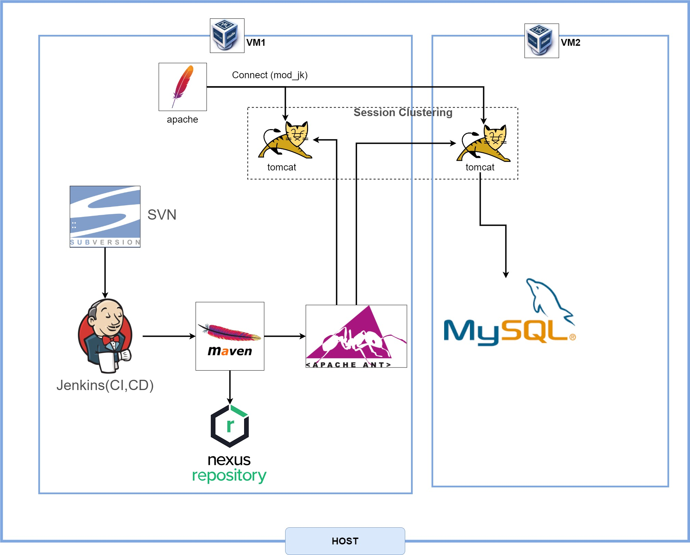
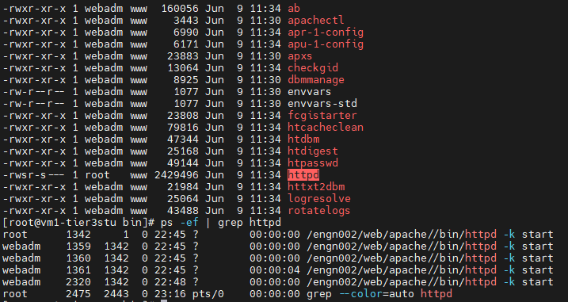
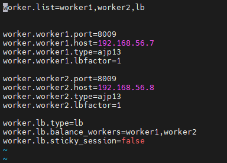
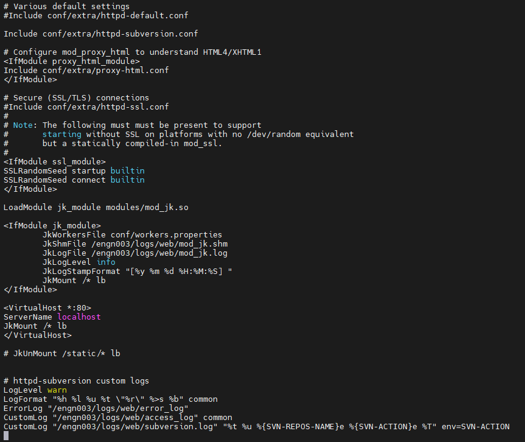
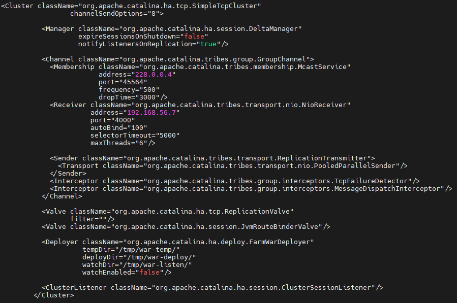
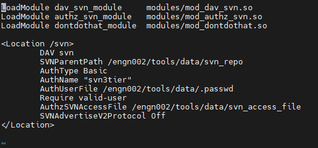
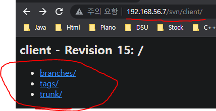
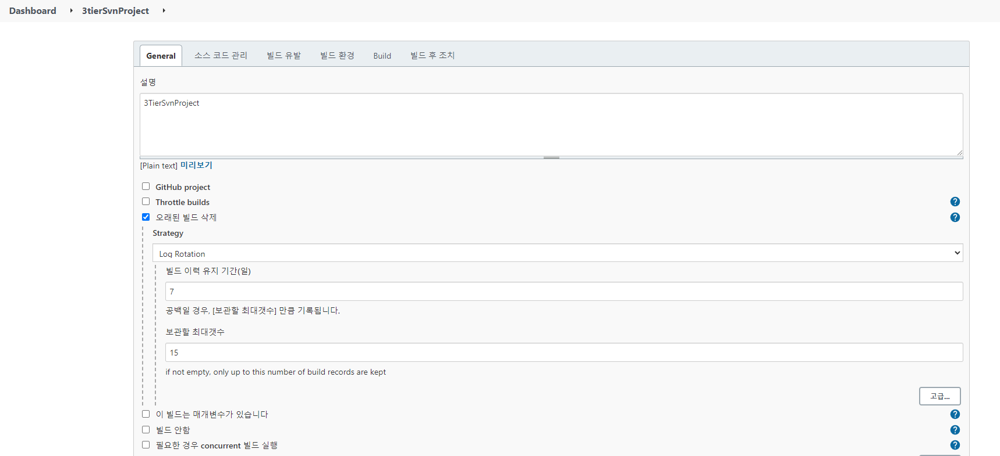
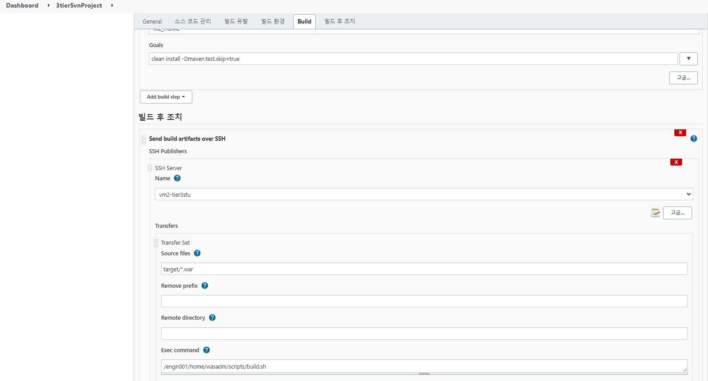

VM환경에서 3Tier Architecture 설계

해당 게시글은 상세한 설명은 없습니다.

해당 프로젝트를 어떻게 구성하였는지에 대한 결과 화면을 보여주기 위한 게시글입니다.

설치 방식은 패키지 설치방식이 아닌 소스 컴파일 설치방식으로 이루어 졌습니다.

---

## 🌡 VirtualBox 환경 구성 및 네트워크 설정


VM1 : NAT,호스트 전용 어댑터

VM2 = NAT,호스트 전용 어댑터

유저, 그룹, 디렉토리 설계

engn001 : 계정 HOME 디렉토리

engn002 : 웹서버, WAS, Mysql, 미들웨어

engn003 : logs 디렉토리

미들웨어 공통 그룹 : www

```shell
engn001/
└── home
    ├── devuser
    ├── jenkins-app
    ├── mysql
    ├── wasadm
    └── webadm
engn002/
├── jdk
│   ├── jdk1.8.0_201
│   └── jdk8 -> jdk1.8.0_201
├── jmeter
│   ├── apache-jmeter-5.4.3
│   └── jmeter -> apache-jmeter-5.4.3
├── maven
│   ├── apache-maven-3.6.3
│   └── m2 -> apache-maven-3.6.3
├── scouter
│   ├── scouter -> scouter-min-2.6.1/
│   └── scouter-min-2.6.1
├── sts
│   ├── spring-tool-suite-4-4.14.1.RELEASE-e4.23.0-linux.gtk.x86_64.tar.gz
│   ├── sts -> sts-4.14.1.RELEASE/
│   └── sts-4.14.1.RELEASE
├── tar-temp
│   └── apache-tomcat-8.5.79.tar.gz
├── temp
│   ├── apr-1.6.5.tar.gz
│   ├── apr-util-1.6.1.tar.gz
│   ├── httpd-2.4.53
│   ├── httpd-2.4.53.tar.gz
│   ├── svntemp
│   ├── tomcat-connectors-1.2.48-src
│   └── tomcat-connectors-1.2.48-src.tar.gz
├── tools
│   ├── data
│   ├── jenkins
│   ├── nexus
│   └── svn
├── was
│   └── tomcat8-1
└── web
    └── apache
engn003/
└── logs
    ├── was
    └── web

```

## 🔑 apache 설치 및 설정

apache 설치 완료 실행 화면




## 🖊 apache tomcat 연결

apache conf 설정 파일



apache tomcat 연결 설정과 SVN 연결 설정 등..



## 📮 tomcat session clustering 구성

tomcat conf/server.xml 세션 클러스터링 설정



멀티캐스팅을 라우팅 설정


## 📍 Mysql 설치 및 연동

Mysql Source 설치 실행화면


## 🖌 svn, jenkins, maven 배포 환경 구성

### 📏 SVN

svn apache 연결 설정



svn 사용자 passwd 암호화


브라우저에서 svn 확인



### 🔍 nexus

Nexus 설치 및 실행


nexus Role 추가 및 계정 설정


settings.xml 설정

```
<server>
<id>releases</id>
<username>nx_user</username>
<password>passwd</password>
</server>
<server>
<id>central</id>
<username>nx_user</username>
<password>passwd</password>
</server>


 <mirror>
      <id>Nexus</id>
      <mirrorOf>*</mirrorOf>
      <url>http://192.168.56.7:8081/repository/maven-central/</url>
 </mirror>
```

pom.xml 설정

```
<distributionManagement> 
    <repository>
	<id>releases</id>
        <url>http://192.168.56.7:8081/repository/maven-releases</url>
    </repository>

    <snapshotRepository>
        <id>snapshots</id>
        <url>http://192.168.56.7:8081/repository/maven-snapshots</url>
    </snapshotRepository>

 </distributionManagement>
```

### 📒 jenkins

Jenkins 배포 환경 구성

배포 스크립트

build.sh
```shell
#! /bin/sh

# build script to deploy

cd /engn002/was/tomcat8-1/webapps

mv ROOT.war backup/ROOT_back$(date '+%Y-%m-%d-%T')
rm -rf ROOT

find /engn001/home/wasadm/target/* -type f -name '*.war' -exec mv {} /engn002/was/tomcat8-1/webapps/ROOT.war \;

/engn001/home/wasadm/scripts/restart.sh
```

restart.sh
```shell
#! /bin/sh

# tomcat restart shell script

cd /engn002/was/tomcat8-1

bin/shutdown.sh

sleep 5;

bin/startup.sh

```

프로젝트 생성 및 설정






빌드 결과


브라우저에서 확인


```toc

```
